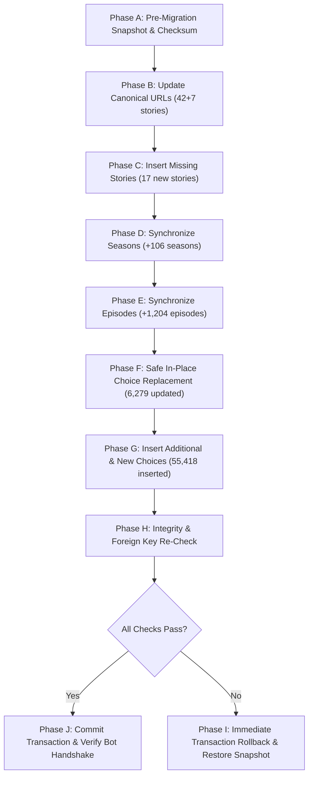

# GamesIsArt Production Migration Plan — PHASE 9

**Статус документа**: РАБОЧИЙ ПРОЕКТ (ПОДГОТОВЛЕН К УТВЕРЖДЕНИЮ)  
**Режим выполнения**: Транзакционный (ACID) с возможностью мгновенного 100% отката  
**Исходная база**: `data/gamesisart/staging.db` (59 источников, 154 сезона, 1 731 серия, 61 697 выборов)  
**Целевая база**: `club_romance.db` (Production)  

> [!WARNING]
> Данный план описывает регламент будущей миграции (PHASE 10).  
> **НА ТЕКУЩЕЙ ФАЗЕ (PHASE 9) МИГРАЦИЯ НЕ ВЫПОЛНЯЕТСЯ.** База `club_romance.db` остаётся строго нетронутой.

---

## 1. Общая архитектура и принципы безопасности

1. **Атомарность всей операции**: Миграция выполняется внутри одной SQLite транзакции (`BEGIN IMMEDIATE ... COMMIT`). В случае любой ошибки (исключение, нарушение ограничений целостности, сбой питания) транзакция откатывается (`ROLLBACK`), возвращая базу в первозданный вид.
2. **Нулевой риск для пользователей**:
   - `progress` (6 строк) привязаны к `story_id`, `season_id`, `episode_id`. Ни один из существующих ID историй/сезонов/серий не изменяется.
   - `subscriptions` (1 строка) привязана к `story_id`. Сохраняется.
   - `choices`: входящих внешних ключей нет. Замена заглушек не затрагивает пользовательские таблицы.
3. **Сохранение 12 ручных записей**: Записи с ID `{1, 2, 31..40}` строго защищены фильтром `WHERE id NOT IN (...)`.
4. **Разделение идентификаторов**: Первичные ключи `staging.db` не навязываются production-базе.

---

## 2. Пошаговый регламент миграции (Фазы A – J)



---

### Phase A: Pre-Migration Snapshot & Checksum
1. Выполнить горячий бинарный бэкап:
   ```powershell
   Copy-Item "club_romance.db" "club_romance.db.backup_pre_phase10_$(Get-Date -Format 'yyyyMMdd_HHmmss')"
   ```
2. Зафиксировать контрольную сумму SHA-256 и размер файла:
   - Размер: `5 636 096` байт
   - SHA-256: `9599558eb6c9646441b437550387c570fd77bc4f964068e1b6e8a7a9c64112ae`
3. Проверить `PRAGMA integrity_check` (должен быть `ok`).
4. Зафиксировать контрольные количества строк:
   - `stories`: 54
   - `seasons`: 60
   - `episodes`: 635
   - `choices`: 8 235
   - `progress`: 6
   - `subscriptions`: 1

---

### Phase B: Update Canonical URLs (42 + 7 историй)
1. Для 42 точно совпавших историй обновить `guide_source_url` с общего каталога на индивидуальные канонические URL GamesIsArt.
2. Для 7 подтверждённых историй-алиасов:
   - ID=47 (`W: Ловчая времени`) → канонический URL `.../Romance_Club_Prohozhdenie_Time.html`
   - ID=49 (`Райский сад`) → канонический URL `.../Romance_Club_Prohozhdenie_Edem.html`
   - ID=54 (`И туман поглотит нас`) → `.../Romance_Club_Prohozhdenie_Morok.html`
   - ID=56 (`Код Шекспира`) → `.../Romance_Club_Prohozhdenie_Code.html`
   - ID=59 (`Адвент №3`) → `.../Romance_Club_Prohozhdenie_Three.html`
   - ID=60 (`Te Amo`) → `.../Romance_Club_Prohozhdenie_Te_Amo.html`
   - ID=61 (`Код Блю`) → `.../Romance_Club_Prohozhdenie_Blue.html`
3. Истории ID=1, ID=2, ID=82 (`TEST_RECORD`) и ID=31, ID=32 (`DUPLICATE`) не затрагиваются.

---

### Phase C: Creation of Missing Stories (17 новых историй)
1. Для 17 историй GamesIsArt, отсутствующих в production (`Секрет Небес: Реквием`, `Сага о грозах`, `Бюро параллельных миров`, `Сердце Треспии`, `Рождённая Солнцем`, `Рождённый Тенью`, `Водяная Лилия` и др.):
2. Генерируются чистые уникальные транслитерированные `slug`.
3. Выполняется `INSERT INTO stories (title, slug, description, guide_source_name, guide_source_url, is_active, created_at, updated_at)`:
   - `guide_source_name = 'GamesIsArt.ru'`
   - `guide_source_url = canonical_url`
   - `is_active = 1`
4. Новые истории получают автоинкрементные `id` (начиная с 83+).

---

### Phase D: Season Synchronization (+106 новых сезонов)
1. Для всех 49 сопоставленных историй и 17 новых историй:
2. Если сезон с данным `(story_id, number)` уже существует — его `id` сохраняется.
3. Если сезон отсутствует (например, новые сезоны в существующих историях или все сезоны новых историй):
   ```sql
   INSERT INTO seasons (story_id, number, title, description, created_at, updated_at)
   VALUES (?, ?, ?, ?, CURRENT_TIMESTAMP, CURRENT_TIMESTAMP);
   ```
4. Всего создаётся **106 новых сезонов** (итого в базе станет 60 + 106 = 166 сезонов, либо 164 без дублей).

---

### Phase E: Episode Synchronization (+1 204 новых серии)
1. Для каждого сезона проверяются серии `(season_id, number)`.
2. Существующие 635 серий сохраняют свои `id`.
3. Для новых серий (всего **1 204 серии**):
   ```sql
   INSERT INTO episodes (season_id, number, title, summary, guide_intro, created_at, updated_at)
   VALUES (?, ?, ?, ?, ?, CURRENT_TIMESTAMP, CURRENT_TIMESTAMP);
   ```
4. Итого в базе станет 635 + 1 204 = 1 839 серий.

---

### Phase F: Safe In-Place Choice Replacement (6 279 обновлений)
1. В сериях, где присутствуют старые заглушки:
2. Исключить ID из списка `{1, 2, 31..40}`.
3. Сопоставить первую реальную распарсенную развилку серии со старой строкой заглушки:
   ```sql
   UPDATE choices
   SET text = ?,
       cost_diamonds = ?,
       tags = ?,
       updated_at = CURRENT_TIMESTAMP
   WHERE id = ?;
   ```
4. Это гарантирует, что 6 279 строк таблицы `choices` обновляются in-place, их первичные ключи `id` остаются прежними, а размер файла базы данных не раздувается фрагментацией.

---

### Phase G: Insert Additional & New Choices (55 418 вставок)
1. Для каждой серии:
   - Оставшиеся реальные выборы (сверх первой заменённой заглушки) в существующих сериях: **11 440 выборов**.
   - Выборы в новых сериях существующих историй: **30 060 выборов**.
   - Выборы в совершенно новых историях: **13 918 выборов**.
2. Вставка выполняется пачками с вычисленным `order_index`:
   ```sql
   INSERT INTO choices (episode_id, order_index, text, cost_diamonds, tags, created_at, updated_at)
   VALUES (?, ?, ?, ?, ?, CURRENT_TIMESTAMP, CURRENT_TIMESTAMP);
   ```
3. Всего вставляется **55 418 новых строк**.

---

### Phase H: Integrity & Foreign Key Re-Check
Не выходя из транзакции, выполняются проверочные запросы:
1. `PRAGMA foreign_key_check;` — результат обязан быть пустым (0 нарушений).
2. `PRAGMA integrity_check;` — обязан вернуть `ok`.
3. Контрольная проверка пользовательских данных:
   - `SELECT count(*) FROM progress;` == 6
   - `SELECT count(*) FROM subscriptions;` == 1
4. Проверка защищённых выборов:
   - Запросы к ID `{1, 2, 31..40}` возвращают неизменённые оригинальные тексты.

---

### Phase I: Rollback Runbook (Регламент отката при сбое)
Если хотя бы одна проверка Фазы H вернула ошибку, либо возникло исключение на Фазах B–G:
1. Немедленно выполнить `conn.rollback()`.
2. Закрыть соединение.
3. Если возникли сомнения в целостности файла, восстановить бинарный снимок:
   ```powershell
   Copy-Item "club_romance.db.backup_pre_phase10_*" "club_romance.db" -Force
   ```
4. Проверить SHA-256 восстановленного файла (должен совпадать с `9599558eb6c9646441b437550387c570fd77bc4f964068e1b6e8a7a9c64112ae`).

---

### Phase J: Post-Migration Verification & Bot Handshake
1. Зафиксировать `conn.commit()`.
2. Запустить `rtk pytest tests` — все тесты бота обязаны проходить.
3. Запустить smoke-тест Telegram-хэндлеров (проверка навигации по историям, отображение серий и выборов с ценами в алмазах).
4. Зафиксировать новый размер базы и SHA-256 в отчёте миграции.
